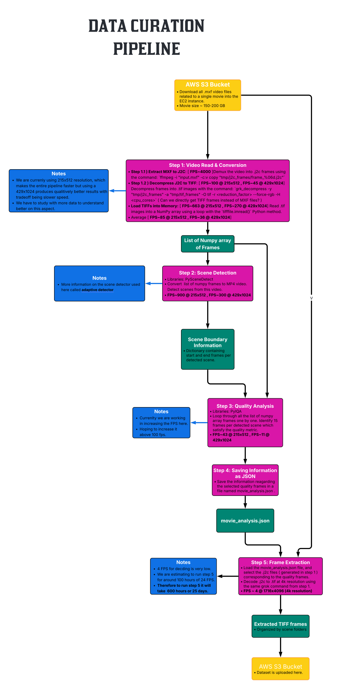

# Video Processing & Super-Resolution Pipeline

End-to-end pipeline for DCI MXF video processing and super-resolution training.

---

I presented this work as poster at IIT Madras [XR Global Symposium](https://xtic.org/xr-symposium/)  


## Project Structure
```
├── JPEG2000_CustomDecoder/    # Custom Python extension for decoding
├── data_pipeline/              # Python based data-pipeline
└── training_pipeline/          # VRT super-resolution training
```

---

## Data Pipeline



**What it does:**
1. Reads 4K MXF files → downsamples to 720p
2. Detects scene changes (PySceneDetect)
3. Finds 15 consecutive high-quality frames per scene (NIQE/MUSIQ metrics)
4. Saves results as JSON

**Run it:**
```bash
cd data_pipeline
python main.py
```

**Key files:**
- `config.py` - Thresholds, sequence length, quality metrics
- `main.py` - Main pipeline orchestrator


---

## Training Pipeline

VRT-based video super-resolution (2x/4x upscaling).

**Structure:** `data_type/movie/scene/frames.tif`

**Run training:**
```bash
cd training_pipeline
python train.py  # Edit config.py first
```

**Files:**
- `dataset.py` - Loads frame sequences
- `losses.py` - Charbonnier, L1, L2, edge losses
- `train.py` / `test.py` - Training and evaluation

---

## Dependencies

**Data Pipeline:** PySceneDetect, PyIQA, OpenCV, ffmpeg, grok  
**Training:** PyTorch, tifffile, scikit-image  
**Decoder:** Rust, PyO3, maturin, vcpkg (Windows)

---


